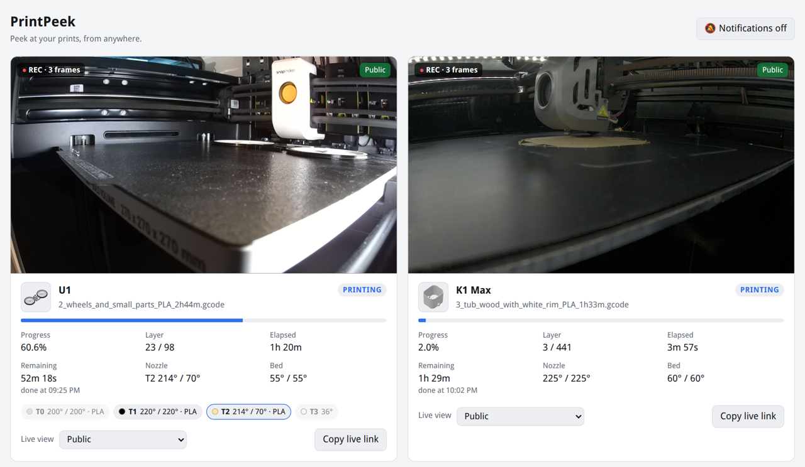
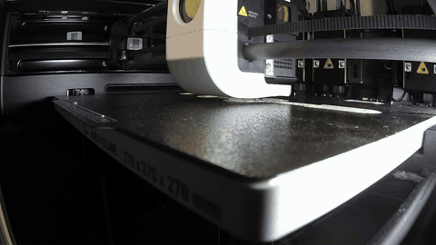
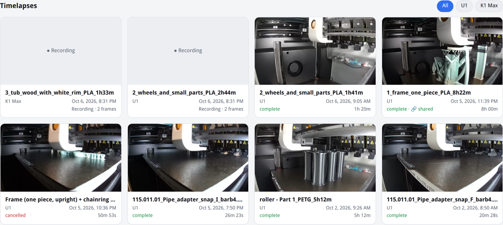
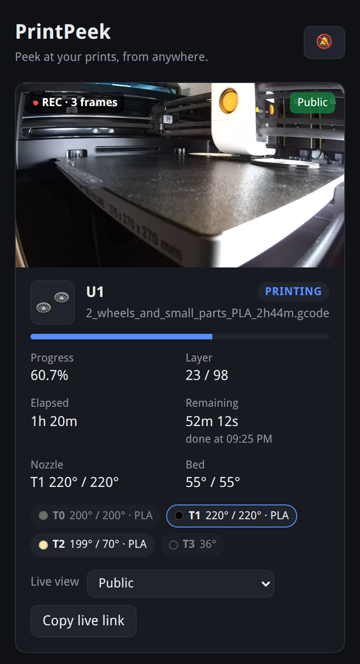
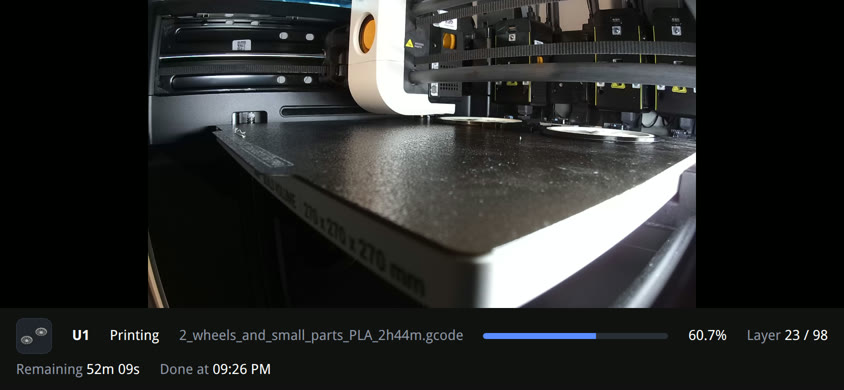

# PrintPeek

**Peek at your prints, from anywhere.**

Live cameras, automatic timelapses and push notifications for every Klipper printer you own.
PrintPeek runs on your home server in Docker and only talks to Moonraker over the network.

**Nothing to install on the printers.** No plugins, no macros, no cloud account.



## Timelapses, without touching the printer

<p align="center"></p>

Every print gets its own timelapse, automatically. PrintPeek follows the print through
Moonraker, grabs a camera frame on every layer change and renders an MP4 when the print is done.
There's no timelapse plugin on the printer and nothing to change in your slicer.

- One frame per layer, so the print grows smoothly instead of jumping around
- Heating, homing and bed probing are left out
- The video ends on the finished print, even on printers that drop the bed at the end
- A restart in the middle of a print picks up the same timelapse
- Browse them per printer, download them, or share one video with a private link



## Share it your way

You decide, per printer, who gets to watch:

- **Private.** Only you, after logging in.
- **Public.** Anyone with the link can watch the live camera and progress.
- **Public for a while.** For 1, 3 or 8 hours, then it switches back to private by itself.
- **Public until this print is done.** Perfect for showing off one print. When it finishes,
  the printer goes private again.

Send friends a `/watch/<printer>` link for a full screen view that works on any phone. The moment
you switch a printer to private, everyone watching is cut off.

Timelapses stay private too. Share a single video with a link of its own, and take it back with
"Stop sharing" whenever you like.

| | Visitors | You (logged in) |
|---|:---:|:---:|
| Live view of public printers | ✔ | ✔ |
| Live view of private printers | | ✔ |
| A timelapse you shared | ✔ | ✔ |
| All timelapses: watch, download, delete | | ✔ |
| Why a print paused, and the photo of it | | ✔ |
| Notifications and sharing settings | | ✔ |

## In your pocket

<p align="center">
  
  &nbsp;
  
</p>

- **Install it like an app.** Add it to your home screen and it opens full screen, with its own icon.
- **Push notifications.** Your phone buzzes when a print finishes, pauses or fails, with a photo
  of that moment. Also when a printer drops off the network in the middle of a print.
- **Light on mobile data.** The live view is converted to H.264: about 3 Mbit/s for a 1080p
  camera, a quarter of what the same camera's MJPEG stream uses, in full resolution.

## Everything else

- **All your printers on one page.** Camera, progress, layer, time left, when it'll be done,
  temperatures and the slicer's preview of what's printing.
- **Know why it paused.** "Filament ran out on T1", "Possible spaghetti, detected by the printer's
  camera", "The G-code paused the print with M600". PrintPeek works it out from the printer's
  sensors, the G-code and the console.
- **Multiple toolheads.** Each tool's temperature and filament colour, and a warning when the
  filament that's loaded doesn't match what the print was sliced for.
- **Easy on the printer.** [go2rtc](https://github.com/AlexxIT/go2rtc) pulls each camera once, no
  matter how many people are watching.
- **Looks, doesn't touch.** PrintPeek never sends a command to a printer. It only reads status and
  camera images.

## Works with

Any printer running Klipper and Moonraker with a webcam set up in Mainsail or Fluidd: a Voron, a
RatRig, a rooted Creality K1, a Snapmaker U1, your own build. The camera is picked up from the
webcam settings you already have.

Tested on a Creality K1 Max and a Snapmaker U1, including the U1's four toolheads and its built-in
spaghetti detection.

## Quick start

You need a machine with Docker that can reach your printers, like a home server or a Raspberry Pi.

```sh
git clone https://github.com/jancoow/PrintPeek.git
cd PrintPeek
cp config/config.example.yaml config/config.yaml
nano config/config.yaml          # add your printers and pick a username and password
docker compose up -d --build
```

Open `http://<server>:9022` and you'll see your printers.

The only printer-side requirement is that Moonraker accepts requests from the server. Add the
server's IP to `trusted_clients` in `moonraker.conf`, or set an `api_key` for the printer in the
config.

<details>
<summary>Running it without Docker</summary>

Needs Python 3.11+ and ffmpeg.

```sh
python3 -m venv venv
venv/bin/pip install -r requirements.txt
CONFIG=config/config.yaml DATA_DIR=data venv/bin/uvicorn app.main:app --port 8080
```

Without go2rtc, remove the `go2rtc:` line from the config. The live view is then the camera's
own MJPEG stream.
</details>

## Using it from outside your home

Put PrintPeek behind a reverse proxy with HTTPS (Nginx Proxy Manager, Caddy, Cloudflare Tunnel)
and make sure `auth` is set in the config. Only expose port 9022.

- Turn on WebSocket support in the proxy ("Websockets Support" in Nginx Proxy Manager). The H.264
  live view needs it; without it viewers get the MJPEG stream.
- HTTPS is also what makes "Add to Home Screen" and notifications work.
- Never expose go2rtc's port 1984. Its API can run commands, which is why the compose file keeps it
  inside the stack.

Without logging in, visitors only see the printers you made public and the timelapses you shared
(see [Share it your way](#share-it-your-way)).

## Notifications

Log in, tap the bell at the top and allow notifications. A test notification arrives right away.
On an iPhone, first add PrintPeek to your home screen and open it from there (iOS 16.4 or newer).

## Tips

**Exact layers.** Layer changes are estimated from the Z height, which works fine. For exact
layers, add this to the layer change G-code in your slicer (PrusaSlicer, OrcaSlicer, SuperSlicer):

```
SET_PRINT_STATS_INFO CURRENT_LAYER={layer_num + 1}
```

**Last frame.** If your printer moves the bed away at the end of a print, PrintPeek notices and
ends the video on the last layer instead. You can force either behaviour with
`final_frame: before_end` or `after_end` per printer.

**Live view quality.** The H.264 settings are the `h264live` preset in `go2rtc/go2rtc.yaml`: the
camera's own resolution at up to 4 Mbit/s, converted only while someone watches (about 40% of a
CPU core per camera on a desktop processor). On a slow upload, use the softer 720p preset with
`h264_options: "#video=h264lite#width=1280"`. With a GPU, set
`h264_options: "#video=h264#hardware"`. To always use MJPEG for one camera, set `h264: false`
under its `camera:`. Browsers that can't play H.264 streams (iOS before 17.1) get MJPEG
automatically.

All settings are explained in [`config/config.example.yaml`](config/config.example.yaml).

## License

PrintPeek is free software under the [GNU AGPL v3](LICENSE): use it, change it and share it.
If you run a changed version for other people, share your changes under the same license too.

Copyright (C) 2026 Janco Kock
