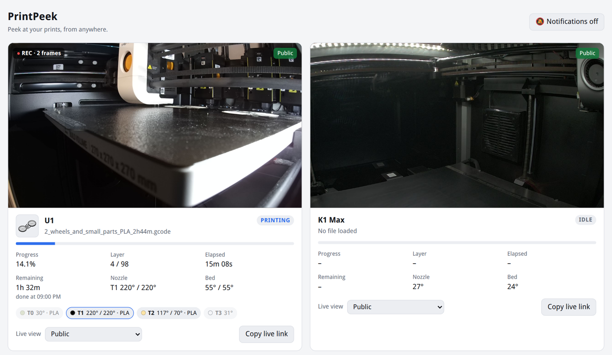

# PrintPeek

**Peek at your prints, from anywhere.**

A small web app that shows all my Klipper printers on one page, with the live camera, and
records a timelapse of every print. It runs on a home server in Docker and only talks to
Moonraker, so nothing has to be installed on the printers.



What it does:

- Live camera, progress, layer, time left, finish time and temperatures per printer, with the
  slicer's preview of what's printing
- Push notifications on your phone when a print finishes, pauses or fails, with a photo
- When a print pauses or fails, it shows why (filament ran out, a pause in the G-code, the
  printer's own spaghetti detection) with a photo of that moment
- Printers with several toolheads (like the U1) show each tool's temperature and filament, and
  warn when the loaded filament doesn't match what the print was sliced for
- Timelapse of every print (one frame per layer), rendered to MP4 with ffmpeg when the print ends
- Camera re-streaming through [go2rtc](https://github.com/AlexxIT/go2rtc), so the printer only
  serves one stream no matter how many people are watching. The live view is converted to H.264,
  which needs about a tenth of the bandwidth of the camera's MJPEG stream (nice on mobile data)
- Make a printer's live view public, for a few hours or until the print is done, and send
  friends a `/watch/<printer>` link
- Share a single timelapse with a private link
- Can be installed on your phone's home screen like an app

I use it with a Creality K1 Max and a Snapmaker U1, but it should work with any printer running
Moonraker (Mainsail or Fluidd).

## Running it

You need Docker with Compose.

```sh
git clone https://github.com/<you>/printpeek.git
cd printpeek
cp config/config.example.yaml config/config.yaml
# edit config/config.yaml: add your printers and set a username/password
docker compose up -d --build
```

Then open `http://<server>:9022`.

Moonraker has to accept requests from the server. Add the server's IP to `trusted_clients` in
`moonraker.conf`, or set `api_key` for the printer in the config.

The camera is picked up from the webcam settings in Mainsail/Fluidd. If that doesn't work you
can set the stream and snapshot URLs yourself, see `config/config.example.yaml`.

### Without Docker

Needs Python 3.11+ and ffmpeg.

```sh
python3 -m venv venv
venv/bin/pip install -r requirements.txt
CONFIG=config/config.yaml DATA_DIR=data venv/bin/uvicorn app.main:app --port 8080
```

Without go2rtc, remove the `go2rtc:` line from the config and the app will proxy the camera
directly.

## On your phone

Open the site on your phone and choose "Add to Home Screen" (Safari) or "Install app" (Chrome).
This needs HTTPS, so it works through your reverse proxy but not on a plain `http://` address.

To get notifications, log in and tap "Notifications off" at the top. You get one when a print
finishes, pauses (with the reason) or fails, and when a printer goes offline during a print. On
an iPhone this only works from the home screen app (iOS 16.4 or newer).

## Live view

With go2rtc running, the live view is H.264 at 720p and at most 1.5 Mbit/s: a 1080p MJPEG camera
easily uses 12 Mbit/s. go2rtc only converts while someone is watching, which takes about a fifth
of a CPU core per camera. Browsers that can't play it (iOS before 17.1) get the MJPEG stream.

The settings are the `h264live` preset in `go2rtc/go2rtc.yaml`. With a GPU, set
`h264_options: "#video=h264#hardware"` in the config. To turn H.264 off for one camera, set
`h264: false` under its `camera:`.

## Why did it pause?

Klipper doesn't keep track of why a print paused, so the app looks in a few places when it
happens: the printer's own error report (Snapmaker printers report their spaghetti detection
this way), the filament sensors, the G-code right before the pause, and the console. If none of
them says anything, it was most likely paused by hand from the screen, Mainsail or an app.

The reason and the photo are only shown when you're logged in.

## Layer detection

For exact layer changes, add this to the layer change G-code in your slicer (PrusaSlicer,
OrcaSlicer, SuperSlicer):

```
SET_PRINT_STATS_INFO CURRENT_LAYER={layer_num + 1}
```

If you already have a layer counter in Mainsail you probably have this. Without it the layer is
estimated from the Z height, which works fine too.

Some printers (like the U1) drop the bed at the end of a print, so the last frame would show an
empty chamber. The app notices this and ends the video on the last layer instead. You can force
it with `final_frame: before_end` or `after_end` per printer.

## Putting it online

If you want to reach it from outside, put it behind a reverse proxy with HTTPS (Nginx Proxy
Manager, Caddy, Cloudflare Tunnel) and make sure `auth` is set in the config. Only expose port
9022. The H.264 live view uses a WebSocket, so turn on WebSocket support in the proxy ("Websockets
Support" in Nginx Proxy Manager). Without it, viewers get the MJPEG stream.

Without logging in, people only see the printers you made public and the timelapses you shared.
The app never sends commands to the printers, it only reads status and camera images.

Don't expose go2rtc's API port (1984). It can be used to run commands, which is why the compose
file doesn't publish it.

## License

PrintPeek is free software under the [GNU AGPL v3](LICENSE): use it, change it and share it.
If you run a changed version for other people, share your changes under the same license too.

Copyright (C) 2026 Janco Kock
